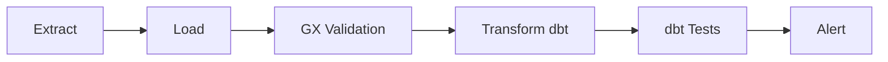

# **Pre-class brief**

## Where are we?

Your automated pipelines are running daily. But last Tuesday, a supplier changed their CSV format and your pipeline loaded garbage data into the warehouse — and nobody noticed until the CFO's dashboard showed negative revenue. You need automated *quality gates* that catch bad data before it reaches the dashboards.

## Why this matters

Data quality is the unsexy, career-defining skill. A pipeline that runs successfully but loads wrong data is *worse* than one that fails loudly. Testing is how you build trust in your data platform. When FreshCart's head of marketing asks "can I trust these numbers?" your answer needs to be backed by automated validation, not a verbal assurance.

## Key concepts

**Data Quality Testing with Great Expectations** — Write "expectations" (rules) about your data: this column should never be null, this value should be between 0 and 10,000, this date should not be in the future. These rules run automatically and produce validation reports. An expectation like "order_total must be positive" catches the negative-revenue bug before it hits the dashboard.  
*->Stage where this is Run:* after the Load (L) step, before Transform (T). Independent GX project executed via the GX CLI or UI.

**dbt Testing** — dbt's built-in tests cover basics (unique, not_null, accepted_values, relationships). The `dbt_utils` and `dbt-expectations` packages extend this dramatically — range checks, expression validation, cross-column consistency. Testing is integrated into `dbt build`, so every model run includes its quality checks.  
*->Stage where this is Run:* during the Transform (T) step, executed as part of the dbt run/test phase.

**Comparison of Part 1 and Part 2**

| Aspect | Great Expectations (Part 1) | dbt Testing (Part 2) |
|--------|-----------------------------|----------------------|
| Placement in ELT | After Load (L), before Transform (T) | During Transform (T) |
| Execution method | Stand‑alone GX project, run via `great_expectations` CLI or UI | Integrated into `dbt test` / `dbt build` |
| Scope | Validates raw loaded tables | Validates transformed dbt models |
| Reporting | GX validation reports (HTML, JSON) | dbt test results in console & `run_results.json` |

**Orchestrating Multi-Tool Pipelines** — In production, your pipeline isn't "run dbt." It's "extract from Postgres, load to BigQuery, run transformations, run tests, alert on failure." Dagster orchestrates this entire chain as a single observable workflow.
